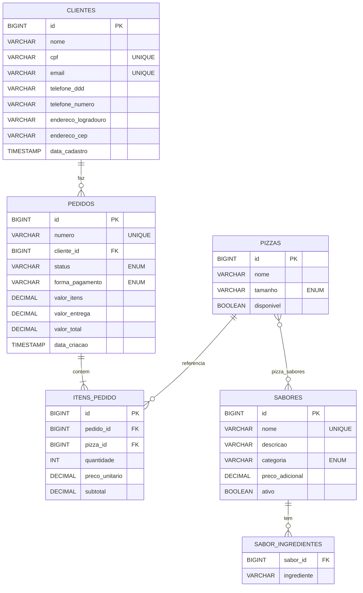
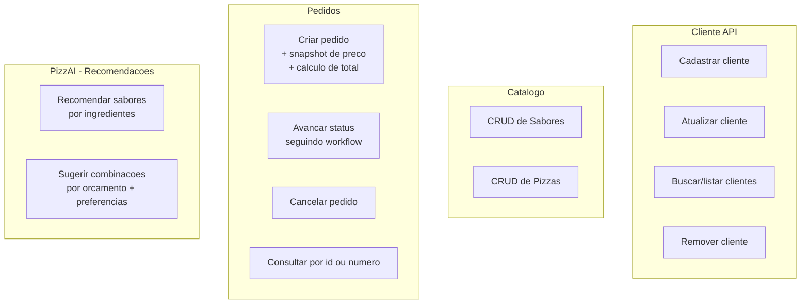
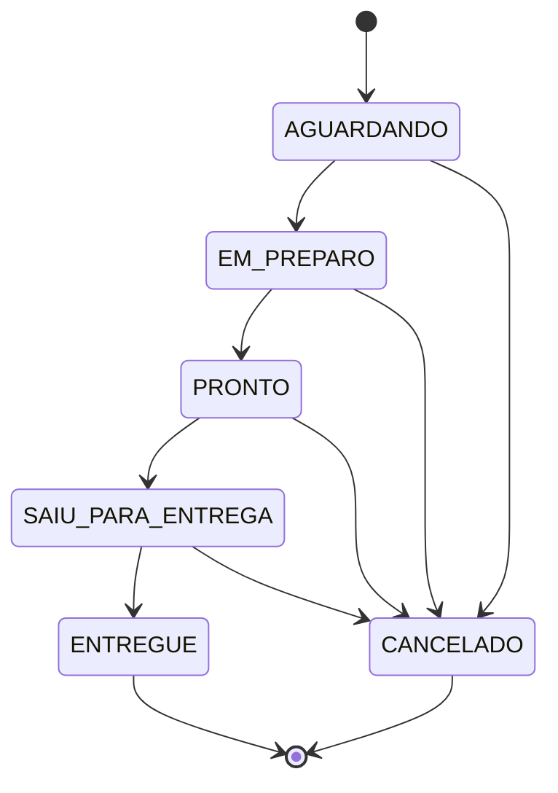

# PizzAI — Sprint 3: SOA e WebServices

API REST de pizzaria construída com **Spring Boot 3.4 + Java 21**, seguindo arquitetura em camadas (controller → service → repository), persistência via **JPA/Hibernate** com **H2 in-memory** e versionamento de schema com **Flyway**. Inclui um módulo **PizzAI** que sugere sabores e combinações de pizza a partir de ingredientes e orçamento.

---

## 1. Tecnologias utilizadas

| Camada            | Tecnologia                                |
|-------------------|-------------------------------------------|
| Linguagem         | Java 21                                   |
| Framework         | Spring Boot 3.4.0                         |
| Web               | Spring Web (REST)                         |
| Persistência      | Spring Data JPA + Hibernate 6             |
| Banco             | H2 in-memory (modo PostgreSQL)            |
| Migrations        | Flyway 10                                 |
| Validação         | Bean Validation (Jakarta Validation)      |
| Boilerplate       | Lombok                                    |
| Documentação      | springdoc-openapi (Swagger UI)            |
| Build             | Maven 3.9                                 |

---

## 2. Como rodar

### Pré-requisitos
- JDK 21+
- Maven 3.9+ (ou use o wrapper `./mvnw` se preferir adicionar)

### Subir a aplicação
```bash
# Compilar
mvn clean package -DskipTests

# Executar
java -jar target/pizzai-1.0.0.jar

# OU em modo dev
mvn spring-boot:run
```

A aplicação sobe em `http://localhost:8080`. Para usar outra porta:
```bash
java -jar target/pizzai-1.0.0.jar --server.port=9090
```

### Pontos de acesso
| Recurso             | URL                                      |
|---------------------|------------------------------------------|
| Swagger UI          | http://localhost:8080/swagger-ui.html    |
| OpenAPI JSON        | http://localhost:8080/v3/api-docs        |
| Console H2          | http://localhost:8080/h2-console         |

**Console H2** — JDBC URL: `jdbc:h2:mem:pizzaidb`, User: `sa`, sem senha.

---

## 3. Arquitetura

### Visão de camadas

```mermaid
flowchart LR
    Client[Cliente HTTP<br/>Postman / Insomnia / curl] -->|JSON| Controller
    Controller[Controller Layer<br/>@RestController + @Valid<br/>ResponseEntity] -->|DTO| Service
    Service[Service Layer<br/>@Service @Transactional<br/>regras de negocio] -->|Entity| Repository
    Repository[Repository Layer<br/>JpaRepository] -->|JPQL/SQL| DB[(H2 in-memory<br/>Flyway migrations)]
    Service -. throws .-> GEH[GlobalExceptionHandler<br/>@RestControllerAdvice]
    GEH -. "JSON erro padronizado" .-> Client
```

### Organização por feature

```
src/main/java/com/pizzai/
├── PizzaiApplication.java
├── cliente/        ← entity, repo, service, controller, dto/
├── sabor/          ← entity, repo, service, controller, dto/
├── pizza/          ← entity, repo, service, controller, dto/
├── pedido/         ← Pedido, ItemPedido, repo, service, controller, dto/
├── recomendacao/   ← service, controller, dto/  (PizzAI)
└── shared/
    ├── enums/      ← TamanhoPizza, CategoriaSabor, StatusPedido, FormaPagamento
    ├── vo/         ← Endereco, Telefone (@Embeddable)
    └── exception/  ← GlobalExceptionHandler, ErrorResponse, BusinessException, ResourceNotFoundException
```

### Diagrama de entidades (ER)



### Casos de uso como serviços



---

## 4. Endpoints

Base URL: `http://localhost:8080/api`

### Clientes
| Método | Endpoint                      | Descrição                          |
|--------|-------------------------------|------------------------------------|
| POST   | `/clientes`                   | Cria cliente                       |
| GET    | `/clientes`                   | Lista paginada (filtro por `nome`) |
| GET    | `/clientes/{id}`              | Busca por id                       |
| PUT    | `/clientes/{id}`              | Atualiza                           |
| DELETE | `/clientes/{id}`              | Remove                             |

### Sabores
| Método | Endpoint                                   | Descrição                                       |
|--------|--------------------------------------------|-------------------------------------------------|
| POST   | `/sabores`                                 | Cria sabor                                      |
| GET    | `/sabores`                                 | Lista (filtros: `categoria`, `apenasAtivos`)    |
| GET    | `/sabores/{id}`                            | Busca por id                                    |
| PUT    | `/sabores/{id}`                            | Atualiza                                        |
| DELETE | `/sabores/{id}`                            | Remove                                          |

### Pizzas
| Método | Endpoint                                                   | Descrição                                |
|--------|------------------------------------------------------------|------------------------------------------|
| POST   | `/pizzas`                                                  | Cria pizza (1 a 4 sabores ativos)        |
| GET    | `/pizzas`                                                  | Lista (filtros: `nome`, `tamanho`, etc.) |
| GET    | `/pizzas/{id}`                                             | Busca por id (com preço calculado)       |
| PUT    | `/pizzas/{id}`                                             | Atualiza                                 |
| DELETE | `/pizzas/{id}`                                             | Remove                                   |

### Pedidos
| Método | Endpoint                          | Descrição                                          |
|--------|-----------------------------------|----------------------------------------------------|
| POST   | `/pedidos`                        | Cria pedido (gera número, calcula totais)          |
| GET    | `/pedidos`                        | Lista (filtros: `clienteId`, `status`)             |
| GET    | `/pedidos/{id}`                   | Busca por id                                       |
| GET    | `/pedidos/numero/{numero}`        | Busca por número (`PZ-AAAAMMDD-XXXXXX`)            |
| PATCH  | `/pedidos/{id}/status`            | Avança status respeitando workflow                 |
| DELETE | `/pedidos/{id}`                   | Cancela pedido                                     |

### Recomendações (PizzAI)
| Método | Endpoint                                                                                | Descrição                                       |
|--------|-----------------------------------------------------------------------------------------|-------------------------------------------------|
| GET    | `/recomendacoes/sabores?ingredientes=queijo&ingredientes=cebola&categoria=TRADICIONAL` | Sabores rankeados por afinidade de ingredientes |
| POST   | `/recomendacoes/combinar`                                                              | Sugere combinações dentro do orçamento          |

---

## 5. Workflow de status do pedido



Transições inválidas retornam **HTTP 422** com mensagem explicativa.

---

## 6. Exemplos de requisição e resposta

### 6.1. Criar cliente — `POST /api/clientes`

**Requisição**
```json
{
  "nome": "Joao Pedro Silva",
  "cpf": "987.654.321-00",
  "email": "joao@email.com",
  "telefone": { "ddd": "11", "numero": "912345678" },
  "endereco": {
    "logradouro": "Av Paulista",
    "numero": "1000",
    "bairro": "Bela Vista",
    "cidade": "Sao Paulo",
    "uf": "SP",
    "cep": "01310-100"
  }
}
```

**Resposta `201 Created`** (header `Location: /api/clientes/2`)
```json
{
  "id": 2,
  "nome": "Joao Pedro Silva",
  "cpf": "987.654.321-00",
  "email": "joao@email.com",
  "telefone": { "ddd": "11", "numero": "912345678" },
  "endereco": {
    "logradouro": "Av Paulista",
    "numero": "1000",
    "complemento": null,
    "bairro": "Bela Vista",
    "cidade": "Sao Paulo",
    "uf": "SP",
    "cep": "01310-100"
  },
  "dataCadastro": "2026-05-09T00:50:58"
}
```

### 6.2. Erro de validação — `POST /api/clientes` sem campos obrigatórios

**Requisição**
```json
{ "cpf": "111.222.333-44" }
```

**Resposta `400 Bad Request`**
```json
{
  "timestamp": "2026-05-09T00:50:58Z",
  "status": 400,
  "error": "Validacao falhou",
  "message": "Um ou mais campos estao invalidos",
  "path": "/api/clientes",
  "fieldErrors": [
    { "field": "nome",     "message": "nome e obrigatorio" },
    { "field": "telefone", "message": "telefone e obrigatorio" },
    { "field": "endereco", "message": "endereco e obrigatorio" },
    { "field": "email",    "message": "email e obrigatorio" }
  ]
}
```

### 6.3. Criar pedido — `POST /api/pedidos`

**Requisição**
```json
{
  "clienteId": 1,
  "itens": [
    { "pizzaId": 1, "quantidade": 2 },
    { "pizzaId": 3, "quantidade": 1 }
  ],
  "formaPagamento": "PIX",
  "valorEntrega": 8.00,
  "observacoes": "Sem cebola por favor"
}
```

**Resposta `201 Created`**
```json
{
  "id": 1,
  "numero": "PZ-20260509-7D6140",
  "clienteId": 1,
  "clienteNome": "Maria Souza",
  "status": "AGUARDANDO",
  "formaPagamento": "PIX",
  "valorItens": 158.00,
  "valorEntrega": 8.00,
  "valorTotal": 166.00,
  "enderecoEntrega": { "...endereco do cliente como default..." },
  "observacoes": "Sem cebola por favor",
  "dataCriacao": "2026-05-09T00:51:07",
  "itens": [
    { "id": 1, "pizzaId": 1, "pizzaNome": "Margherita Tradicional", "quantidade": 2, "precoUnitario": 46.00, "subtotal": 92.00 },
    { "id": 2, "pizzaId": 3, "pizzaNome": "Quatro Queijos Grande",  "quantidade": 1, "precoUnitario": 66.00, "subtotal": 66.00 }
  ]
}
```

### 6.4. Atualizar status — `PATCH /api/pedidos/1/status`

**Requisição**
```json
{ "status": "EM_PREPARO" }
```

**Resposta `200 OK`** — pedido com status atualizado.

### 6.5. Transição inválida — `PATCH /api/pedidos/1/status` (de `AGUARDANDO` para `ENTREGUE`)

**Resposta `422 Unprocessable Entity`**
```json
{
  "timestamp": "2026-05-09T00:51:07Z",
  "status": 422,
  "error": "Regra de negocio violada",
  "message": "Transicao de status invalida: AGUARDANDO -> ENTREGUE",
  "path": "/api/pedidos/1/status",
  "fieldErrors": []
}
```

### 6.6. Recomendar sabores — `GET /api/recomendacoes/sabores?ingredientes=mussarela&ingredientes=cebola`

**Resposta `200 OK`**
```json
[
  {
    "saborId": 2,
    "nome": "Calabresa",
    "categoria": "TRADICIONAL",
    "precoAdicional": 8.00,
    "ingredientesAcertados": 2,
    "ingredientesEmComum": ["mussarela", "cebola"],
    "scoreCompatibilidade": 80.0
  },
  {
    "saborId": 6,
    "nome": "Pepperoni",
    "categoria": "ESPECIAL",
    "precoAdicional": 14.00,
    "ingredientesAcertados": 1,
    "ingredientesEmComum": ["mussarela"],
    "scoreCompatibilidade": 50.0
  }
]
```

O `scoreCompatibilidade` combina **precisão** (quantos ingredientes pedidos foram cobertos) e **cobertura** (qual porcentagem do sabor é composta pelos ingredientes pedidos). Resultado entre 0 e 100.

### 6.7. Sugerir combinações — `POST /api/recomendacoes/combinar`

**Requisição**
```json
{
  "tamanho": "GRANDE",
  "orcamento": 80.00,
  "minSabores": 1,
  "maxSabores": 2,
  "ingredientesPreferidos": ["queijo", "mussarela"],
  "ingredientesProibidos": ["camarao"]
}
```

**Resposta `200 OK`** — lista das melhores combinações:
```json
[
  {
    "tamanho": "GRANDE",
    "fatias": 8,
    "sabores": [
      { "id": 3, "nome": "Quatro Queijos", "precoAdicional": 14.00 },
      { "id": 6, "nome": "Pepperoni",      "precoAdicional": 14.00 }
    ],
    "precoTotal": 80.00,
    "scoreCompatibilidade": 70.0,
    "justificativa": "Combinacao de 2 sabor(es) dentro do orcamento de R$ 80.00. Atende 1/2 ingredientes preferidos."
  }
]
```

---

## 7. Padrões aplicados

| Critério                                      | Onde está aplicado                                                                                  |
|-----------------------------------------------|-----------------------------------------------------------------------------------------------------|
| Organização por feature                       | Pacotes `cliente/`, `sabor/`, `pizza/`, `pedido/`, `recomendacao/`, `shared/`                       |
| VO + DTO + Enum                               | `shared/vo/Endereco`, `shared/vo/Telefone`; `*/dto/*RequestDTO`/`*ResponseDTO`; `shared/enums/*`    |
| Camadas separadas                             | Controller → Service → Repository                                                                   |
| ResponseEntity                                | Em todos os controllers, com status correto (`201 Created`, `200 OK`, `204 No Content`)             |
| Bean Validation (`@Valid`)                    | DTOs anotados com `@NotBlank`, `@Email`, `@Pattern`, `@DecimalMin`, `@Size`, etc.                   |
| `@RestControllerAdvice`                       | `shared/exception/GlobalExceptionHandler` trata 400/404/422/500 com payload padronizado             |
| Migrations                                    | Flyway em `resources/db/migration/V1..V5__*.sql`                                                    |
| CRUD completo                                 | Cliente, Sabor, Pizza, Pedido (criar/listar/buscar/atualizar/remover)                               |
| Integridade referencial                       | FKs em `pedidos.cliente_id`, `itens_pedido.pedido_id`/`pizza_id`, `pizza_sabores.*`                 |
| Documentação API                              | springdoc + Swagger UI em `/swagger-ui.html`                                                        |

---

## 8. Observações

- Para limpar e recomeçar do zero, basta reiniciar a aplicação — H2 é in-memory.
- O número do pedido é gerado no formato `PZ-AAAAMMDD-XXXXXX` (UUID truncado).
- O preço da pizza é calculado dinamicamente em `Pizza.calcularPreco()` somando o preço base do tamanho com o preço adicional dos sabores.
- Ao criar um pedido, o `precoUnitario` do item é **snapshot** — alterações posteriores no preço da pizza ou sabor não afetam pedidos antigos.
- O endereço de entrega defaults para o endereço do cliente se não informado no pedido.
